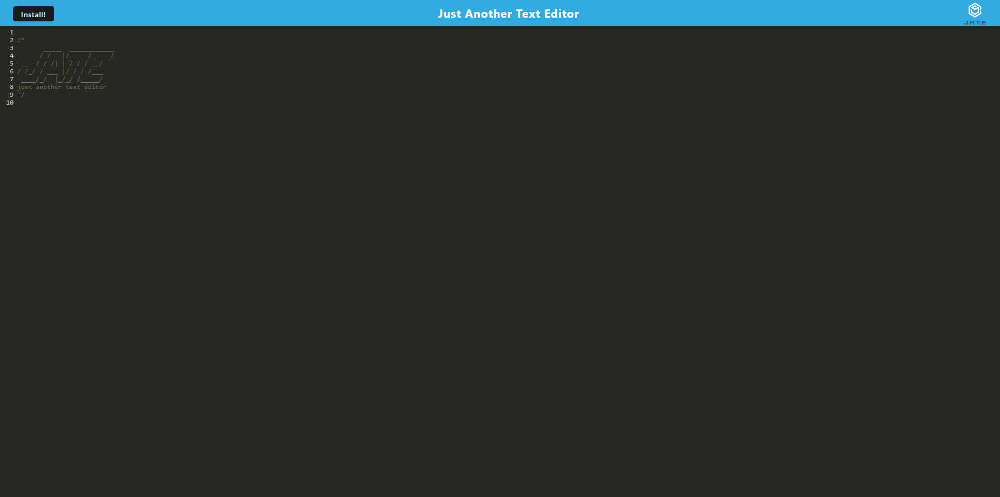

# PWA Text Editor

[](https://opensource.org/licenses/MIT)


## Description
A single-page text-editor designed as a Progressive Web App (PWA). You can have uninterrupted access to your documents both online and offline. IndexedDB provides a storage which can be accessed upon opening the text-editor.

## Table of Contents
- [Installation](#installation)
- [Usage](#usage)
- [Contributing](#contributing)
- [License](#license)
- [Questions](#questions)

## Installation
Clone the repository:
```
git clone git@github.com:AlinaB108/pwa-text-editor.git
```
Install dependencies:
```
npm i
```

## Usage
Start the server:
```
npm start
```
Click on install button at the top left corner if you want to open the text-editor from your desktop.

You can find the deployed site here: [TEXT-EDITOR](https://pwa-text-editorab-190627d0702e.herokuapp.com/)

---

To test the offline feature it's better to open the app in Incognito mode. To do that follow these instructions:
- At the top right, click More and then New Incognito Window.
- A new window appears. In the top corner, check for the Incognito
You can also use a keyboard shortcut to open an Incognito window:

Windows, Linux, or Chrome OS: Press Ctrl + Shift + n.

Mac: Press ⌘ + Shift + n.




## Contributing
1. Fork the project by clicking Fork in the top-right corner of the page.
2. Clone the repository.
3. Create a new branch to work on.
4. Commit the changes.
5. Push to the branch.
6. Create a pull request.


## License
[](https://opensource.org/licenses/MIT)

https://opensource.org/licenses/MIT 
    
## Questions
If you have any questions, send me a message [GitHub](https://github.com/AlinaB108) or send me an email: [alinachristabel108@gmail.com](alinachristabel108@gmail.com)